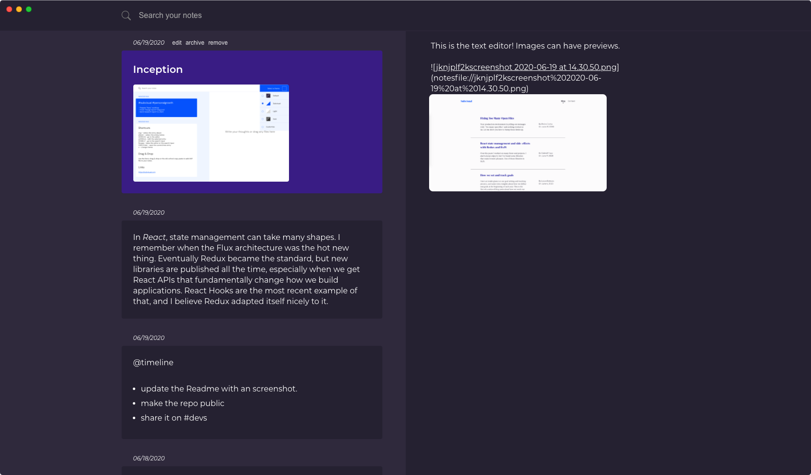

# NoteDown

- It's keyboard-driven. There are shortcuts for almost everything.
- There are no severs and accounts. Your data is saved to the file system so
  you don't have to trust anyone else.
- It's simple. Just write and drop files into it. Use the search to find what
  you're looking for.

## Features

- Markdown editor with image previews.
- Change the theme or pick your colors.
- Shortcuts for almost everything.
- Drop files.
- Paste images.
- Full-text search.
- Folder sync to backup and restore.
- Simplicity.

## Todo

- Code signing.
- Allow writing charts and digrams in markdown.
- Search text inside images and PDFs.
- Mobile app.
